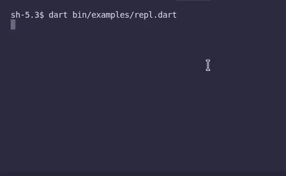

# PureDartLua

<!-- TOC -->
- [PureDartLua](#puredartlua)
  - [Tutorial](#tutorial)
    - [Run The Driver](#run-the-driver)
    - [Use In Your Own Code](#use-in-your-own-code)
    - [Custom Data](#custom-data)
    - [As An Interpreter](#as-an-interpreter)
  - [DOT File Visualizer](#dot-file-visualizer)
  - [All Features](#all-features)
- [Tests](#tests)
- [Work In Progress!](#work-in-progress)
  - [Missing Lua Lang Support](#missing-lua-lang-support)
  - [Extra Goals](#extra-goals)
  - [Unplanned](#unplanned)
<!-- /TOC -->



This is a custom a custom `Lua 5.5` interpreter and utilities written from scratch in pure Dart.
I wrote this as a part of a series of learning exercises on how to write my own compilers and programming languages.

## Tutorial
This package exports a full fledged library and a simple executable for running lua scripts.
Runnable examples below can be found under [`./bin/examples/`](./bin/examples/).

- Basic interpreter: [`repl.dart`](./bin/examples/repl.dart)
- Read data in dart: [`integrate.dart`](./bin/examples/integrate.dart)
- Using the autodoc: [`autodoc.dart`](./bin/examples/autodoc.dart)

### Run The Driver
To get started, run [`bin/input.lua`](./bin/input.lua). Everything after the file path is passed into the `run()`
starter as input arguments table `arg`.

```bash
dart bin/main.dart -e bin/input.lua hello world!
```

### Use In Your Own Code
It's easy. Just include the utilities file that includes default runtime behaviors and the Std library.

```dart
import 'package:puredartlua/runner.dart';

void main() {
  run(parse("print('hello, world!')")!);
}
```

This will execute and print `hello, world!` to the console.

### Custom Data
But you probably want to define your own tables and functions in lua. And probably read those
values back in dart too.

For this, you need a custom runtime via the `Evaluator` class and
use the specific `(bool, LuaObject) runner(AST, constructor, onErrors?)` utility function.

```dart
import 'package:puredartlua/runner.dart';

/// This example driver shows the user how to define custom methods in dart,
/// run lua programs calling custom methods,
/// and find the result from lua back to dart.
void main() {
  final evaluator = Evaluator();

  final addOne = LuaFuncBuilder.create('add_one')
      .arg('n')
      .exec(
        call: () {
          final n = evaluator.findVar('n')?.valueAsInt() ?? 0;
          return n + 1;
        },
      );

  evaluator.defGlobal(addOne);

  runner(parse("x = add_one(6)")!, constructor: () => evaluator);

  int? result = evaluator.findVar('x')?.valueAsInt();

  // Prints: 7
  print(result);
}
```

See the implementation for the ready-to-use `Evaluator` class in [`lib/lua/lua.dart`](./lib/lua/lua.dart).

### As An Interpreter
To make a LUA interpreter, simply feed `runner(...)` the result of the user's parsed input.
The runner returns a tuple of type `(bool ok, LuaObject out)`. You can print the result to the user.
Quit the loop when the user types a signal. For example `exit`.

```dart
import 'dart:convert';
import 'package:puredartlua/runner.dart';

void handleErrors(List<String> errs) => errs.forEach(print);

void main() {
  final evaluator = Evaluator();
  print('Press enter to continue on next line.');
  print('Blank lines terminates input.');
  print('Type "exit" to quit.');
  print('Type "dump_scope" to write the global scope to console.');
  print('-------------------');
  String content = '';
  bool loop = true;
  while (loop) {
    stdout.add('\$ '.codeUnits);
    final String input = stdin.readLineSync(encoding: utf8)?.trim() ?? '';

    if (input.isNotEmpty) {
      if(content.isEmpty) {
        switch (input.toLowerCase()) {
          case 'exit':
            loop = false;
            continue;
          case 'dump_scope':
            evaluator.impl.scope.dump();
            content = '';
            continue;
        }
      }
      content += '$input\n';
      continue;
    } else {
      content += input;
    }

    final ast = parse(content, onErrors: handleErrors);
    content = '';

    if (ast == null) continue;

    final (_, out) = runner(
      ast,
      constructor: () => evaluator..clearResults(),
      onErrors: handleErrors,
    );

    print(out);
  }
}
```

## DOT File Visualizer
Run

```bash
dart bin/main.dart -v my_script.lua
```

The DOT file will be embedded in an HTML page `my_script.lua.html`.

## All Features
- MIT Licensed.
- No FFI or extra dependencies.
- DOT file generator and visualiser for input scripts.
- [Autodoc][AUTODOC] generation and programmable API so your own libs can generate docs to share with your consumers.
- Create your own custom runtime and define `LuaObject`s in dart.
  - `Truthy` and `Native2Lua` Dart class extensions for convenient bridge between userdata and lua types.
  - Parser, Evaluator, and StdRuntime classes extensible and modifiable.
- Ready-To-Use `run()` and `runner()` utility functions for immediate execution.
- Includes powerful examples: Command Line Interface, Interpreter, AutoDoc generates HTML documentation, and custom runtime integration.
- `LuaFunctionBuilder` class to conveniently build complex lua functions.
- You can emit, collect, and act on your own custom warnings, diagnostic info, or errors.
- Aims to be Lua 5.5 compliant.
  - See this [section](#missing-lua-lang-support) for remaining issues.
- Globals provided by `_ENV` and legacy `_G` upvalues.
- Metatables supported via `setmetatable(t, mt)` and `getmetatable(t)` as you'd expect.
- Metamethods: `__call`, `__index`, `__newindex`, `__add`, `__sub`, `__mul`, `__div`, `__mod`, `__pow`, `__unm`, `__idiv`, `__band`, `__bor`, `__bxor`, `__bnot`, `__shl`, `__shr`, `__concat`, `__len`, `__eq`, `__lt`, `__le`, `__tostring`.
- Standard lua runtime libs (partial implementation).
  - strings
  - include
  - ipairs
  - pairs
  - table
  - print
  - math
- `pcall()` implementation.
  - `xpcall()` is just another call to `pcall()` in this runtime.
- Functions taking one argument of either string literal or table literal can omit parenthesis.
- Math operations on numeric-coercible strings returns numbers.
- For-loop iterators and stateless iterators.

> Because this is a pure dart lua interpreter, it is not expected to be as fast
> as the C ffi alternative libs for Dart. However, it is much more programmer friendly!

# Tests
All tests are under the `/test/` directory. The driver is [`test/lualib_test.dart`](./test/lualib_test.dart).
The test scripts are under `/test/assets/`.

The driver uses a custom preflight setup that extracts every
comment of the form `-- Expected: ...` and compares the output in `Evaluator.impl.stdOut`. If the output
does not match the expected string, then it is an error. This allows the scripts to contain the data
needed for the checks without requiring additional setup.

For example:
```lua
-- This is why we're here.
local str = 'Hello, world'

-- Expect: Hello, world
print(str)

-- Testing variadic args in print.

-- Expect: 1 2 3 nil true
print(1, 2, 3, nil, true)

-- Expect: \n
print()

-- Expect: 1
print(1)
```

Running this test will result:
```lua
Hello, world
1 2 3 nil true
1
--- Test Results ---
OK
```

Note that your terminal (VSCode) may supress dart's `print(...)` newlines `\n` and empty string tokens `''`. The standard
lua `print(...)` method will capture these even if they do not show up in the terminal.

# Work In Progress!
I am using this in my own projects and as such I have not created tutorials or get started guides.
I will get around to that when I can!

## Missing Lua Lang Support
Here's what's left to be compliant with most `Lua 5.5` programs:
- Attribute modifiers `<const>` and `global`.
- I missed `do ... end` blocks. I rarely see those used. To be added.
- Lua supports different numeric form representations such as hex.
- Bytecode generation. Which is necessary because...
  - We need to jump on `goto` and resume on `::label::` statements.
  - `Coroutines` library **is** added but the runtime needs bytecode to make use of it.
  - No tail call support. This optimization also requires bytecode to be effective.

## Extra Goals
- Semantics: code path type unification.
  - `return` statements could have the function's final type identified.
  - Nondeterministic functions should be identified as such.
    - This would allow invariant code paths to be protomoted to constant value generation.

## Unplanned
This interpreter makes use of Dart's execution stack and memory model and it does not explicitly cleanup any memory.
Therefore, anything related to Lua's garbage collector is not supported and not planned to be supported in the forseeable future.

This also means the metamethods related to GC such as `__mode`, `__close`, and `__gc` are not implemented either. If you use
them your scripts will run fine, but any side effects these metamethods have will do nothing in this runtime.

[AUTODOC]: ./lib/docs/autodoc.dart
